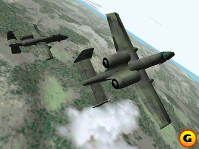
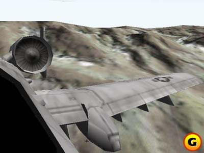
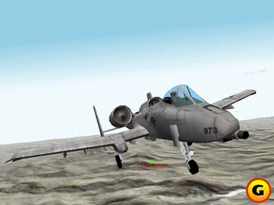

*The following is a reproduction of the article [originally published on GameSpot, written by Bruce Geryk](https://www.gamespot.com/features/pcgraveyard_janes/index.html/)* 

[Wayback Machine mirror](https://web.archive.org/web/20100302183455/http://www.gamespot.com/features/pcgraveyard_janes/index.html)

# Jane's A-10 Warthog

By Bruce Geryk

Design by Ethan O'Brien

## Index

* [Introduction](#introduction)
* [The Story Begins](#the-story-begins)
* [Engine Trouble](#engine-trouble)
* [The Paint of the Campaign](#the-pain-of-the-campaign)
* [The Changing Marketplace](#the-changing-marketplace)
* [The State of the Game](#the-state-of-the-game)
* [Moving Toward Multiplayer](#moving-toward-multiplayer)

## Introduction

In the history of flight simulators there is probably no name more venerable than that of Origin's Austin Skunkworks. Responsible for the legendary Longbow series, this cohort of programmers has built a truly legendary reputation for excellence. The fact that this team was working on a sim based on the A-10 Warthog aircraft generated considerable enthusiasm in the gaming community, even before the first concrete details had been released to industry news organizations. In a way, the tragedy of A-10 is that it was one of the few simulations that seemed to generate serious interest among gaming fans in general, and not just among the connoisseurs of serious flight simulators.

Logically, A-10 was a perfect extension of the Austin development team's talents that had been showcased so brilliantly in the Longbow series. Both Longbow and A-10 dealt with low-flying, ground-attack aircraft, and the move from helicopters to the more general appeal of fixed-wing planes promised to extend Longbow's audience even further. During A-10's development, there was a notable buzz about the game that extended even to those who didn't fall into the category of traditional simulation enthusiasts. The fact that the game was never finished not only deprived the gaming community of this kind of broad-appeal sim but also denied the development team a chance to display its virtuosity to a larger audience.

For those confused by the names Electronic Arts, Origin Systems, and Jane's, it is important to keep firmly in mind what forces were at work during the development of A-10. Electronic Arts owns a great many development studios, and Origin Systems is just one. Several years ago, Electronic Arts acquired the Jane's license from the international defense consultancy of the same name. The job of developing flight simulations bearing the Jane's name was given to various developers, and over the years a number of games have been released by Electronic Arts bearing the Jane's label. However, it is important to note that there is no independent entity known as "Jane's Combat Simulations." The games bearing this brand name have been developed by various teams, including Austin Skunkworks and the Baltimore Skunkworks, which developed both F-15 and F/A-18. Israeli Air Force and U.S.A.F. were produced by Israeli development house Pixel.
Yet the idea of a "development team" can create an illusion of continuity that simply doesn't exist when tracking the personnel who worked on the Austin team's projects. Only two programmers (producer Will McBurnett and wrapper programmer Steve Muchow) actually coded the Longbow series through all its iterations. The remarkable thing about the Austin Skunkworks team was that at any given time, the team members included some of the industry's most outstanding talent. While the Austin team has been marked by turnover, the Baltimore team has remained fairly stable over that same period of time. Perhaps one of the lessons to be learned from the cancellation of A-10 is that constancy and longevity go hand in hand when working on such complex, demanding projects as military flight simulations.

## The Story Begins

The story of A-10 Warthog began in March 1998, several months after the Austin Skunkworks team's triumphant release of Longbow 2 in December 1997. The team had originally been working on Longbow 3, which was to have been a "graphics statement" with new cockpits and Russian aircraft. According to a source who was with Origin at the time (and whose assertion is disputed by executive producer Andy Hollis), "We were scheduled to work on a massively multiplayer simulation for Jane's after Longbow 2 had shipped, but due to circumstances at Origin, we had to come up with a game that would ship ASAP. The biggest, constant theme to understand is that in a lot of ways the team members were betrayed. We finished four games in 18 months, all with the hope of this massively multiplayer electronic battlefield." Disappointed that the promised massively multiplayer project was not forthcoming, three key programmers - Brent Oster, Todd Fiala, and Joe Enzminger - quit Origin to form their own company, Check Six Productions. (Fiala briefly returned to Origin, then left again.)

Because Longbow 3 had been intended to showcase improved graphics, the loss of three such crucial members of the team forced a reconsideration of priorities. Still denied the "electronic battlefield project," the Longbow 2 team was asked to come up with a product that could "leverage existing technology" and provide revenue for 1999. In other words, design a game using the Longbow 2 engine that could ship quickly. It was in this way that A-10 was born: a stopgap project at Origin Systems intended to bridge the gap between current priorities and new ones that were coalescing but had not yet been fully articulated. Months later, these new priorities would be trotted out to explain the cancellation of the game.

At first, everything seemed straightforward enough. The feature list for A-10 was to be very close to that of Longbow 2. The same engine was to be used, with new Air Force-style missions and briefings and improved artificial intelligence. There was to be a Forward Air Controller (FAC) interface, which would let players use assets, such as F-16s and other A-10s, to take out targets using a real-time interface. And then there was the terrain. An ex-member of the Origin team explains: "The Longbow 2 engine was grid-based height fields. The A-10 system gave us all the abilities of Multigen, and we had kick-ass terrain. It was better than Apache/Havoc."
But the Longbow 2 code was the key. Rather ironically, Longbow 2 had also been intended as a quick, money-making project. The original Longbow didn't support 3D acceleration, as it had been released just as the first Voodoo card from 3DFX was gaining acceptance. Longbow 2 started out as nothing more than an effort to update the original Longbow and generate some quick revenue for Origin. However, the efforts of the team members, particularly Tsuyoshi Kawahito and Brent Oster, resulted in the final product being hailed as a classic. If A-10 was to achieve a similar feat it would have to be on the shoulders of this classic code.

## Engine Trouble

The development of A-10 became one of unchanging goals coupled with evolving means. As a source on the development team puts it, "Besides all the people coming and going, and trying to get the graphics engine nailed down, the game we were working on the last day was the same game we pitched in our design document." Unfortunately, the same cannot be said of the development team. When dealing with a team as talented as the Austin Skunkworks, it was perhaps inevitable that individual team members would leave to pursue different or more lucrative projects. As a game, A-10 never changed focus. But as a development project, it was a completely different story. As work progressed, it became clear that the initial intention of using the Longbow 2 code would simply not fly.

As a source from the team explains, "The A-10 engine started as the Longbow 2 engine. This was a huge mistake, but we had no choice, since we had to get a game done in about eight months. As time went on, we realized that this was not going to work, so we started changing systems out." Eventually, all of the graphics, all of the network code, all of the flight model, most of the simulation, and some of the wrapper would be changed. In yet another irony, according to several sources, the game could almost certainly have been finished faster had the decision been made from the outset to develop a brand-new engine. Furthermore, most of the Longbow 2 code had been written by people "long gone" from Origin Systems, and as work progressed it became clear that this was a significant obstacle to the game's timely completion.

This problem of outdated, cryptic code permeated every aspect of the sim's development. Alex Pavloff, who was then between his junior and senior years at the University of Houston, was hired as a summer intern on the project just as it was beginning, and shared the difficulties presented by having to reuse old programs. Still, A-10's basic concept remained on firm ground. It was to have a fully-3D cockpit and flight realism at least as good as those in A-10 Cuba.
Pavloff was assigned to help with the campaigns. There were to be two, one set in Korea and the other in Germany. The first was to be scripted, while the second would be "apparently dynamic" like that in Longbow 2. Pavloff was to develop the single missions for the game (a total of 16, with eight for each campaign) and after doing some write-ups and having them approved, he started to work on them in the mission builder. Says Pavloff, "This is where my problems began."

## The Pain of the Campaign

The Pain of the Campaign
"Simply put, the mission builder was pretty lousy," says Pavloff. "The program was a Win32 GUI [graphical user interface] application written in C. If I knew then what I know now, I would have asked permission to rewrite the thing in C++ and MFC, or even in Visual Basic. The mission builder had originally been written by Tsuyoshi Kawahito, who had left Origin after Longbow 2 to go to work for Microprose on European Air War. Apparently, he was the master programmer. He'd work late, get his stuff done, but he didn't comment his code. Clark Janes, the guy who got to work on the mission builder for A-10, was constantly fixing bugs in the editor, and the real designers and I would sometimes get multiple builds in one day in an attempt to make the thing work. Sometimes, however, the missions that we had made wouldn't work anymore in new versions, leading to much repetitive work in an annoying GUI."

While the team was working on the missions, the issue of the campaign structure came up. Because they were supposed to be based on the Longbow 2 code, the campaigns would be structured in the same way. This meant that they would have the "apparently dynamic" structure that Andy Hollis referred to repeatedly in the newsgroups as "smoke and mirrors." Pavloff explains: "The campaigns in Longbow 2, while seeming dynamic to the user, in fact, really weren't. The Longbow 2 campaign editor basically involved the designers creating multiple locations for the enemy troops on each phase line, and creating multiple paths and targets, and letting a random number generator create the missions. It became obvious that the mission builder had enough problems, and the programmers were slowly getting backed up to the point where the 'dynamic' campaign was going to have to be cut." So the A-10 programmers were faced with the possibility of having a game based on the Longbow 2 engine that actually had a less variable campaign than Longbow 2. This was an example of how, as code advanced from the Longbow 2 base, certain features either had to be left behind or made to work with the changing code. And this meant investing time. The "Longbow 2 shortcut" was already proving to be a false one.

As such problems began to appear, it became apparent to the team that the game could not possibly meet its ship date of first quarter, 1999. There was simply too much uncommented and hard-to-follow code from Longbow 2 that had been written by people who had left the company. This code had to be changed.
And there were other problems afoot that were much more serious than campaign structure. One of them was that Origin had inadvertently stumbled onto a gold mine with its Ultima Online massively multiplayer franchise. When it was originally proposed, the Ultima Online was actually projected to have lower sales numbers than the final numbers proposed for A-10.

## Origin Shifts Focus

At the time that A-10 was cancelled, Origin was predicting the game would sell 40,000 copies. According to a former employee of Origin, "The decision to move to massively multiplayer projects was at the Origin level. Origin had stumbled onto the success of Ultima Online. It was not planned. UO was forecast at 15,000 subscribers and two shards. I think those numbers are ten times greater, still, two years later. It makes about $1.5 million a month."

The success of Ultima Online had made Origin eager to capitalize on its success. Furthermore, Origin's management had changed in the summer of 1999, with Jack Heistand, formerly of TEN and EA Sports, taking over as CEO. In the words of Andy Hollis, "With the change of leadership at Origin, everything was looked at again in a new light." This change in priorities did not go unnoticed by the development team, as a source from the team reveals, "The first inkling I got was in September '98 when it became obvious that A-10 and Origin's online strategy did not mix. It was obvious that we had the best team in the building, and we should be doing online stuff! When we approached Lucas for the Star Wars license, that was the first step. That fell through, so [we] started to design Wing Commander Online. This was after the entire Wing Commander Prophecy team left for Bootprint. We asked for a decision to be made about A-10's future - with expectations that it would be supported, marketed, and sold well, or dropped right then - so we could work on the more important, more strategic, and much cooler Wing Commander Online. For some reason, Electronic Arts (not Origin) management said 'no.' They wanted the short-term A-10 money."

Andy Hollis denies that Origin asked that A-10 be scrapped in favor of Wing Commander Online (or any other online project), although he confirms that this was an idea that was "considered by management." There was no formal cancellation request though, says Hollis, because "things never got that far. At Origin, just as at any company, the status of ongoing projects is under constant evaluation, and there were certainly thoughts that the assets being used on A-10 could be better allocated elsewhere. But there was never a time when a formal proposal was made to Electronic Arts that A-10 be cancelled, so Wing Commander Online could be done and Electronic Arts said 'no.'" The reason that the team was not assigned to an online sim project, Hollis says, was that "even a team as talented as the one working on A-10 couldn't just pick up and start doing a massively multiplayer game. There is a big learning curve." But the signs were there: The game was in danger of being cancelled.
While there was no formal announcement of the game's cancellation yet, A-10 was conspicuous in its absence from E3, the Electronics Entertainment Expo held annually in Los Angeles. The show is traditionally the time for companies to show off their upcoming products, and Electronic Arts raised some eyebrows at the show by displaying only F/A-18 and U.S.A.F.

## The Changing Marketplace

Computer Gaming World writer Gordon Berg says that when questioned about the status of A-10 at E3, then-Electronic Arts public-relations representative Kristen McEntire told him that there was only room for two sims to be shown at E3, and the decision had been made to leave A-10 at home. Berg says that she cautioned him not to draw any conclusions from this decision.

This decreased enthusiasm for the Jane's name reflected a marketplace that had recently been flooded with flight sims. Jane's F-15 and Jane's World War II Fighters, Falcon 4.0 and European Air War from Hasbro/Microprose, as well as Microsoft's Combat Flight Simulator had all been released in 1998. Longbow 2 and Jane's U.S. Navy Fighters '97 had come out in 1997. The market was clearly becoming flooded. A former Origin Systems employee explains the Jane's label's fall from grace:

"The Jane's brand was the darling for a while, because it went from $0 to several million, and went to number one in market share. When the Jane's stuff stopped growing, it stopped being the darling. Then Jane's World War II fighters came along, spent some serious cash, and did not sell. Microsoft stole all World War II combat sales that year [with Combat Flight Simulator]. That was the death knell for Jane's products. No one wanted to be a part of it. All the people who started it - Paul Grace, Andy Hollis, and Frank Gibeau - either left or went to different things. There was no champion at the corporate level, and the marketing guys hated it. Bye-bye."

Microsoft's Combat Flight Simulator had indeed ruled the simulation market that year, demonstrating the company's enormous brand power. Also, according to Andy Hollis, "The PC games market is a moving target," where "consumer tastes keep changing." This is "unlike consoles," Hollis says, where tastes are "more straightforward." When the success of Ultima Online was added to the mix, there was less and less of a reason, from a business standpoint, to continue with A-10, especially at a public company like Electronic Arts whose shareholders expected continued large sales growth. Flight sims were not a growth business, it seemed.

The corporate reasons for A-10's cancellation were thus very much in line with the new strategy at Origin. However, much has also been made of the game's apparently "terrible state" when it was cancelled. An article in the October 1999 issue of Computer Gaming World, written by editor Ken Brown, quoted sources as saying that "A-10 was in very bad shape graphically. There were serious speed issues - even on a Pentium II 400 with a Voodoo 2."

While the game was certainly behind schedule, several sources have vehemently denied that graphics issues had anything to do with cancellation. Executive producer Andy Hollis claims that while he "wasn't ecstatic" over the condition of the game when it was cancelled, "it certainly wasn't in bad shape."

## The State of the Game

Denny Atkin, editor of Computer Games Magazine, was one of the only writers to get a good look at the game prior to cancellation. "It didn't have a state-of-the-art 'look' because it didn't have the new graphic engine yet," says Atkin. But what he did see made it clear that "the flight dynamics were amazing, as was the level of research they'd incorporated into the plane's systems, weapons, and so on."

A member of the A-10 team elaborates: "The stuff we showed at the last press showing in June was test data because we were still in the research phase on the terrain. The problem with the terrain was that we were developing a new engine. We only worked on it for five months. How long does it take most people to make an engine from scratch? A year? Two? Besides, our games always looked like crap right into beta. That is because we had such short development cycles that we had to put off our optimization until the end." Even F-15, which was developed by the separate Baltimore team "didn't get explosions until two weeks before it shipped," a source reports. The development team was now working with Terrex, a high-end terrain tool designed for the professional simulation industry. Art director Vince Lin and contract 3D programmer Donavon Keithley had left the original code far behind, forging ahead to create a virtually brand-new terrain engine. No longer based on the Longbow 2 code, the A-10 terrain engine would boast detail down to the level of street signs.

The new code, when compounded by the personnel changes, had conspired to delay A-10 by at least six months. In the end, time simply ran out. The game had missed several deadlines, and it was clearly not going to ship in 1999. In July of 1999, Origin pulled the plug. There was no light at the end of the tunnel, and despite the work that had been put in, the project was cancelled. Origin Systems' director of communications David Swofford explains, "We cancelled the project because it helped facilitate our transition into online-only games."

The online-only strategy was now firmly entrenched at the company. The extent to which single-player games were abruptly ditched can be seen in what happened to the last two single-player projects in development at Origin Studios: A-10 and Ultima: Ascension. The difference between the two, says Andy Hollis, was that Ascension was a "key part of the Ultima franchise and was directly tied to the Ultima online community, so it made sense to continue that." A-10, adrift without a strategy for flight simulators, didn't have Ultima Online's lifeline, and thus was canned.

Ultima: Ascension was simply pushed out the door, regardless of the fact that it was obvious that it was in no state to ship. The first patch was actually dated before the official release date. Now, with a new set of patches out, the game's message boards have been closed to new posts. Essentially, it has been consigned to oblivion. All in the rush to move to online-only. In the words of an ex-Origin employee, "That is why Ascension is ignored now. No one cared, even when it shipped. It was just a milestone to get past to move on to the big time."

## Moving Toward Multiplayer

Moving Toward Multiplayer
Rather than being offered a new project, The A-10 team's individual members were either reassigned or they left the company altogether. According to Swofford, "Many of the people on the A-10 team were transitioned into online projects which were underway at the time." Apparently, not many stayed. A source on the A-10 team states that out of a team that numbered around 20 individuals when it was cancelled, "Right now, there are only seven of those people still at Origin. They are all on Privateer Online." A-10 did, however, almost get revived after cancellation, and Electronic Arts entered into talks with old hand Tsuyoshi Kawahito to perhaps reuse the A-10 code on a project for his own firm, Third Wire Productions.

According to Andy Hollis, these talks never proceeded past the negotiation stages. As Hollis puts it, "Had it actually gone forward, it probably would have made more sense for it to happen as Longbow 3, but the reality is that combat sims are really just nonstarters as far as the sales and marketing people go." So the revival of A-10 died before it started. The last single-player study sim to carry the Jane's label was F/A-18, a product of the Baltimore Skunkworks team that did F-15. But even that team is out of the flight-sim business now, according to Electronic Arts, and its current project remains a mystery. Rumors have been circulating that the team is now working on PlayStation2 titles, a rumor Andy Hollis denies.

The irony of the A-10 story is that a game whose cancellation has widely been held as the death knell of the hard-core sim was conceived and developed as nothing more than a vehicle for generating fast revenue for Origin Systems by using existing technology and personnel. And even if the game had shipped on schedule, it is likely that it would not have changed the business calculus at Electronic Arts and Origin by a single integral. Simulations no longer provided a return on investment that justified their production. This didn't mean they didn't sell: Private Electronic Arts' sales numbers show that the original Longbow shipped more than 600,000 units worldwide. And, together, the five Longbow releases (Longbow, Flashpoint: Korea, Longbow Gold, Longbow 2, and Longbow Anthology) shipped more that 1.2 million copies. But the cost of production had gotten inordinately high, and returns were steadily diminishing.

In the words of Andy Hollis, "Everybody was feature-creeping where the bar was," and expectations for new sims had simply become too high. "Building a product that would satisfy all these expectations would cost a tremendous amount of money," and the result is that "no one wants to go there." Are flight sims dead forever, then? "I'm sure sims will make a comeback," says Hollis optimistically. "If everyone leaves the field, then someone is bound to step into the void eventually." But how long flight-sim fans are going to have to wait remains an open question.

[Thanks go to Gordon Berg for assistance in the preparation of this article]
